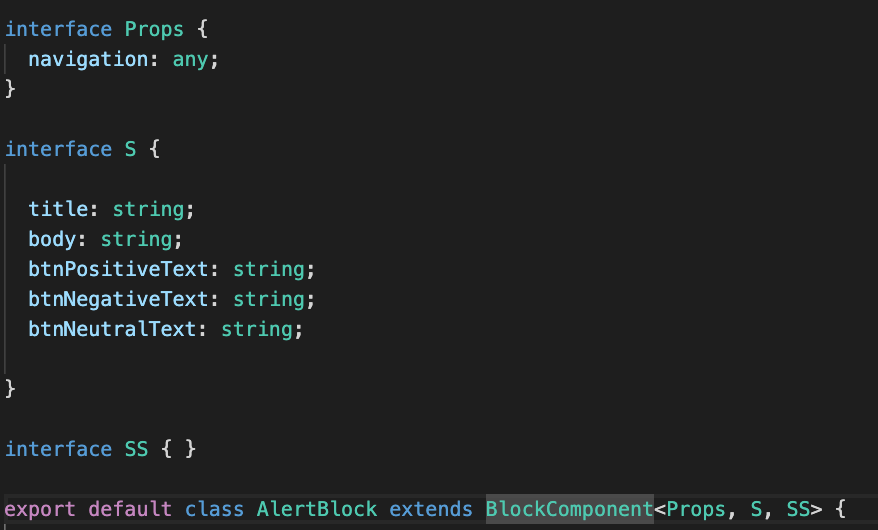

Executive Approver: Tooraj Helmi

Authors: \@joseph.rifkin and \@david.he

  -------------- ----------- -------------- --------- -------------
  **KICK OFF**   **DRAFT**   **COMPLETE**   **PRM**   **RELEASE**
  -------------- ----------- -------------- --------- -------------

{width="2.0928029308836393in"
height="0.4427088801399825in"}

# 

#  

# Version Control

  Version   Changes   Author                       Date     Comments
  --------- --------- ---------------------------- -------- ----------
  1         Initial   \@joseph.rifkin \@david.he   4/3/20   
  2                                                         

###  

**[Version Control](#version-control) 2**

> [Getting Started](#getting-started) 3
>
> [React Native Application Process](#react-native-application-process)
> 3
>
> [Running Building Blocks React Native Master
> App](#running-building-blocks-react-native-master-app) 4
>
> [Web](#web) 4
>
> [iOS](#ios) 4
>
> [Android](#android) 4
>
> [Development Files Rules](#development-files-rules) 4
>
> [Project Structure](#project-structure) 4
>
> [Block Code Structure View vs.
> Controller](#block-code-structure-view-vs.-controller) 5
>
> [Creating your first block](#creating-your-first-block) 6
>
> [Inheriting from BlockComponent](#inheriting-from-blockcomponent) 6
>
> [Assuming that your block is in the packages/blocks/your_block folder,
> you should import the BlockComponent, runEngine, IBlock, as well as
> the MessageEnum
> classes.](#assuming-that-your-block-is-in-the-packagesblocksyour_block-folder-you-should-import-the-blockcomponent-runengine-iblock-as-well-as-the-messageenum-classes.)
> 7
>
> [Subscribing to messages](#subscribing-to-messages) 7
>
> [Receiving messages](#receiving-messages) 7
>
> [Sending messages](#sending-messages) 8
>
> [Installing dependencies](#installing-dependencies) 8

### Getting Started

### React Native Application Process

Project Requirements will contain a \[branch\] and repo locations for
Project

  ------------------------------------------------------
  \$ git clone -b \[branch\] PROJECT_REPO \--recursive
  ------------------------------------------------------

  ---------------------------------
  \$ cd PROJECT_REPO_NAME && yarn
  ---------------------------------

#### Running Building Blocks React Native Master App

##### Web

  -----------------------------
  \$ yarn workspace web start
  -----------------------------

##### iOS

  ----------------------------------------------------------------------------------------------------------------------------------------------------------------------------------------------------------------------------------------------
  \$ cd packages/mobile/ios && pod install && cd ../../../ && npx react-native bundle \--entry-file ./packages/mobile/index.js \--platform ios \--dev true \--bundle-output ./packages/mobile/ios/main.jsbundle \--assets-dest ios && yarn ios
  ----------------------------------------------------------------------------------------------------------------------------------------------------------------------------------------------------------------------------------------------

##### Android

  -------------------------------------------------------------------------------------------------------------------------------------------------------------------------------------
  \$ export JAVA_HOME=\`/usr/libexec/java_home -v 11\`; java -version; export ANDROID_HOME=\${HOME}/Library/Android/sdk; export PATH=\${PATH}:\${ANDROID_HOME}/emulator; yarn android
  -------------------------------------------------------------------------------------------------------------------------------------------------------------------------------------

#### Development Files Rules

-   Start with common **Web & Mobile** Component Controller and
    > Component View using react-native and js

-   If there is a layout only issue use **Web & Mobile** Component
    > Controller + **Mobile** and **Web** Component Views

-   Last if there is a truly unique **Web** or **Mobile** only
    > dependency (ie. Facebook/Google Log In) create **Mobile** and
    > **Web** (ReactNative/JS/ReactJS) Component Controller + **Mobile**
    > and **Web** (ReactNative/JS/ReactJS) Component Views

-   If there is unique code other than styles needed for **iOS** vs
    > **Android** then a Component will be created and placed under
    > **./packages/component**

-   **Styles** should be use react-native Platform.OS

#### Project Structure

+-------------------------+
| Project Root\           |
| ├── packages\           |
| ├── blocks              |
|                         |
| ├── components          |
|                         |
| ├── src                 |
|                         |
| ├── framework           |
|                         |
| ├── package.json        |
|                         |
| ├── src\                |
| ├── Blocks\             |
| ├── Messages\           |
| ├── mobile              |
|                         |
| ├── package.json        |
|                         |
| ├── App.tsx             |
|                         |
| ├── index.js            |
|                         |
| ├── ios                 |
|                         |
| ├── android\            |
| ├── web                 |
|                         |
| ├── package.json        |
|                         |
| ├── config-overrides.js |
|                         |
| ├── src                 |
|                         |
| ├── App.ts              |
|                         |
| ├── inex.js             |
+=========================+
|                         |
+-------------------------+

#### Block Code Structure View vs. Controller

*[IMPORTANT]{.ul}*

**The Components Rendered View Code can be standalone allowing View to
be created and connect to the Controller for all Complement Logic.**

**Replace Example Base Domains and Endpoints**

**[[https://bx-staging.engineer.ai]{.ul}](https://bx-staging.engineer.ai)**

[**[https://stg.builder-blocks-api.com]{.ul}**](https://bx-staging.engineer.ai)

+--------------------------------+
| Block\                         |
| ├── src\                       |
| ├── BlockScreenController.tsx\ |
| ├── BlockScreen.tsx\           |
| ├── config.tsx                 |
|                                |
| ├── assets                     |
+--------------------------------+

BlockScreenController

-   Inherits from BlockComponent\<Props,S,SS\>

    -   Contains Block Logic

BlockScreen

-   Inherits from BlockScreenController

    -   Implements Component Render Method

config.tsx

-   Block Text

-   Block End-points

-   Block Asset Objects

### Creating your first block

#### Inheriting from BlockComponent

We define a block as a component that can send and receive messages. To
add this capability, the block needs to inherit from BlockComponent. See
example below:

{width="6.5in"
height="3.9305555555555554in"}

#### Assuming that your block is in the packages/blocks/your_block folder, you should import the BlockComponent, runEngine, IBlock, as well as the MessageEnum classes. 

Notice that BlockComponent also receives the generic type - \<Props, S,
SS\>. Each of these should be defined as an interface. When first
getting started, it's ok to create the interfaces and leave them empty.

**Prop** defines the props that are passed in from the component\'s
parents.

**S** contains the state variables that the component uses.

**SS** stands for snapshot which will be empty most of the time. You can
read more about it
[[here]{.ul}](https://stackoverflow.com/a/57066957/2723329).

import { BlockComponent } from
\"../../../framework/src/BlockComponent\";

import { runEngine } from \"../../../framework/src/RunEngine\";

import { IBlock } from \"../../../framework/src/IBlock\";

import MessageEnum, {

getName

} from \"../../../framework/src/Messages/MessageEnum\";

#### Subscribing to messages

Subscribing to a message is how we tell a block to listen for a specific
message. You can listen to multiple messages at the same time. If it's
an existing message, just choose the Just put them into an array and
pass it into the **attachBuildingBlock** method.

this.subScribedMessages = \[

getName(MessageEnum.AlertMessage),

getName(MessageEnum.NavigationPayLoadMessage),

\]

runEngine.attachBuildingBlock(this as IBlock, this.subScribedMessages);

#### Receiving messages

After subscribing to messages, we will get notifications when the
subscribed messages are received. Most of the time, you just need to
check the message.id for the message type. The id is a string
representing the message. In order to compare against our Enums, we call
getName to convert the MessageEnum to its string equivalent.

Once you have the message you want, you can write your code to handle
the action.

async receive(from: string, message: Message) {

if (getName(MessageEnum.AlertMessage) === message.id) {

this.navigateToAlertPage(message);

} else if (getName(MessageEnum.NavigationPayLoadMessage) === message.id)
{

//do something

}

}

#### Sending messages

At some point, you will also need to send a message to another block.
Below is a basic example. First we instantiate a new message object with
the name HelloMessage - which comes from the MessageEnum.HelloMessage.
Next, we set the text properties of the message to the data that we want
to send. Finally, we call this.send and pass the message object.

sendHelloMessage() {

const msg: Message = new Message(getName(MessageEnum.HelloMessage));

msg.properties\['text'\] = 'hello world';

)

this.send(msg)

}

#### Installing dependencies

As a general rule of thumb, if the package you're using is specific to
web components, install it in the **/packages/web/** level. If it is
specific to mobile, install it in the **/packages/mobile/** level. Or,
if it's platform agnostic, and may be used by all blocks, install it at
the /packages/blocks level.
